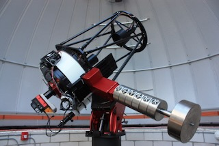

# Dr. Jeffrey Sabby

### Astrophysicist • Physicist • Educator • Observational Astronomer • Mechatronics

*Stellar Astrophysics • Eclipsing Binary Stars • Spectroscopy • Exoplanets • Observational Astronomy • Mechatronics • Scientific Computing*

Astronomical telescope and instrumentation

---

## Scientific Identity

I am an astrophysicist, physicist, educator, observational astronomer, and engineer whose work is driven by a fundamental interest in understanding physical systems through observation, measurement, computation, and experiment.

My research has focused particularly on stellar astrophysics, eclipsing binary systems, spectroscopy, stellar radial and rotational velocities, exoplanets, and observational astronomy. I am especially interested in problems where careful observations can be combined with physical models and computational methods to extract fundamental properties of astronomical systems.

Much of my work also lies at the intersection of astronomy, instrumentation, mechatronics, and computation. I design and build astronomical instrumentation and automated observatories, develop scientific software and data-analysis methods, and work with embedded computers, sensors, telemetry, data-acquisition systems, autonomous vehicles, and feedback-control systems. My engineering interests include Raspberry Pi and microcontroller-based systems, real-time sensing, avionics, GNSS/RTK positioning, 3D-printed mechanical systems, autonomous rovers and multirotor aircraft, and experimentally validated control systems.

Teaching and research are closely connected in my work. I approach both from the perspective that physics is not simply a collection of established results, but a process of asking questions, constructing testable models, making measurements, confronting those models with evidence, and revising our understanding when the observations demand it.

---

## Research Interests

My current and continuing research interests include:

- Stellar astrophysics
- Eclipsing and spectroscopic binary systems
- Stellar radial and rotational velocities
- Astronomical spectroscopy
- Exoplanet detection and characterization
- Time-series analysis
- Observational astronomy
- Astronomical instrumentation
- Mechatronics and embedded systems
- Sensors, telemetry, and data acquisition
- Autonomous systems and feedback control
- Microcontrollers, Raspberry Pi, and real-time instrumentation
- 3D-printed mechanical and electromechanical systems
- Automated observatories
- Scientific computing and data analysis

---

## Scientific Approach

My work follows a simple principle: physical understanding should remain anchored to observation and testable prediction.

The recurring workflow is:

**Question → Model → Prediction → Observation → Measurement → Analysis → Validation → Interpretation**

Computational methods, instrumentation, and theory are tools within that process. Their value ultimately depends on whether they improve our ability to make reproducible measurements, test physical models, quantify uncertainty, and extract reliable information from nature.

---

## Mechatronics and Engineering

My engineering work emphasizes the integration of mechanics, electronics, sensors, computation, and control into experimentally testable systems.

Recent projects have included:

- Navio2/Raspberry Pi avionics systems
- Autonomous rover platforms
- Autonomous quadcopter and hexacopter systems
- Real-time telemetry and data acquisition
- RTK-enhanced GNSS positioning
- Environmental sensor packages
- 3D-printed avionics housings
- 3D-printed gimbal and thrust-vectoring hardware
- Feedback-control systems for rocket stabilization
- Autonomous mission planning
- Embedded sensing and microcontroller-based instrumentation

A recurring theme in these projects is the integration of physical modeling with direct experimental measurement. Systems are designed, instrumented, tested, and analyzed using recorded sensor and telemetry data so that predicted behavior can be compared directly with measured performance.

These projects reflect the same philosophy that guides my astrophysical research: construct a physical model, instrument the system, acquire quantitative data, compare prediction with measurement, and use the residuals to improve the design.

---

## Current Areas of Work

Current efforts include observational studies of binary stars and exoplanets, astronomical data analysis, scientific software development, automated observing systems, embedded instrumentation, autonomous mechatronic systems, and computational approaches to astrophysical and engineering problems.

Additional sections of this site will document current research projects, publications, observatories, scientific software, teaching materials, mechatronics projects, and selected technical work.

---

**Research • Publications • Teaching • Software • Observatories • Mechatronics**

