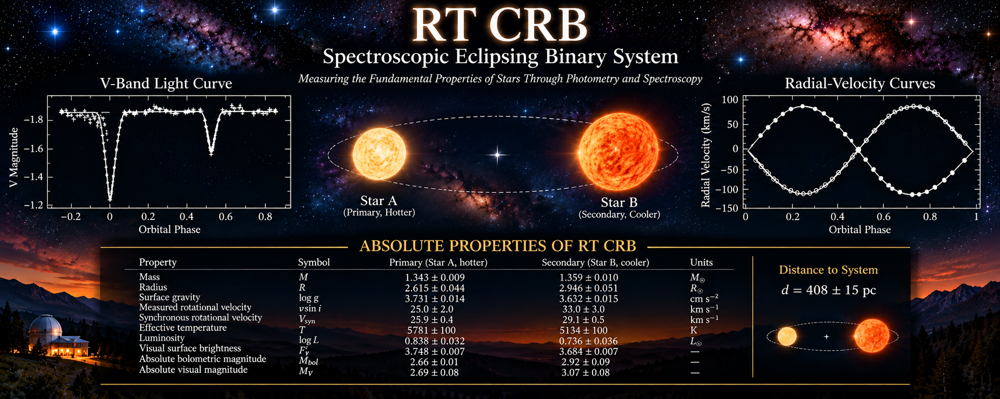

::: {.column-margin}
<div class="x-updates-panel">

### Featured Publication

**Sabby & Lacy (2003)**

*Absolute Properties of the Eclipsing Binary Star RT Coronae Borealis*

**The Astronomical Journal**
Volume 125, pp. 1448–1457

[Find Publication on NASA ADS](https://ui.adsabs.harvard.edu/search/q=RT%20Coronae%20Borealis%20Sabby%20Lacy%202003){target="_blank"}

---

### RT CrB — At a Glance

| Property | Value |
|:---|:---|
| Classification | Detached eclipsing binary |
| Spectroscopic type | SB2 |
| Orbital period | 5.117 days |
| Eccentricity | 0 (adopted) |
| Mass A | $1.343\,M_\odot$ |
| Mass B | $1.359\,M_\odot$ |
| Radius A | $2.615\,R_\odot$ |
| Radius B | $2.946\,R_\odot$ |

*Stellar parameters from Sabby & Lacy (2003).*

---

### Spectroscopic-Eclipsing Binaries Papers of the Month

**October 2026**

---

**1. EPIC 211391083 — Fundamental Stellar Parameters**

*MNRAS (2026)*

A detached, double-lined eclipsing binary with stellar masses and radii measured to approximately 1% precision.

Combining K2 photometry with spectroscopic radial velocities provides an important benchmark for stellar evolution models.

[Read Publication](https://academic.oup.com/mnras/article/551/2/stag1440/8747737){target="_blank"}

---

**2. TESS Photometry and LAMOST Spectroscopy of 10 Detached Eclipsing Binaries**

*Wang et al., AJ (2025)*

An investigation of ten detached eclipsing binary systems using space-based photometry and ground-based spectroscopy.

The study demonstrates how complementary observations constrain fundamental stellar properties.

[Read Publication](https://doi.org/10.3847/1538-3881/adf337){target="_blank"}

---

**3. High-Resolution Spectroscopy During Total Eclipses**

*Astronomy & Astrophysics (2024)*

High-resolution spectroscopy obtained during total eclipses provides valuable information about individual stellar atmospheres.

Combined with radial-velocity measurements and JKTEBOP light-curve modeling, these observations help determine stellar masses, radii, and evolutionary properties.

[Read Publication](https://www.aanda.org/articles/aa/full_html/2024/11/aa50607-24/aa50607-24.html){target="_blank"}

---

*Selected peer-reviewed publications in spectroscopic eclipsing binary research.*

</div>
:::

<div class="website-hero">
  
</div>


*RT Coronae Borealis is a detached, double-lined spectroscopic eclipsing binary. Its eclipses constrain the orbital geometry and relative stellar dimensions, while radial-velocity measurements establish the dynamical scale. Together, these observations permit precise determinations of the stellar masses and radii.*

> **Research provenance:** The numerical stellar parameters discussed below are attributed to the published investigation by Sabby and Lacy (2003). Equations and numerical comparisons are included to explain their physical interpretation. The banner is illustrative; its graphical elements should not be treated as independently validated observational data. Historical observations, modern archival measurements, and new theoretical interpretations will be documented separately as the research program develops.

## Explore RT CrB: Interactive Observations and Orbital Solutions

The interactive visualizations below reproduce the original photometric
and spectroscopic observations of RT Coronae Borealis alongside the
calculated orbital solutions from the published investigation.

The photometric solution was generated using **EBOP**, while the
radial-velocity solution was obtained using **SPECOB**.

Use the orbital-phase slider to explore the relationship between
stellar eclipses and the radial velocities of the two components.

```{=html}
<link rel="stylesheet" href="dashboard/rtcrb_dashboard.css">

<div id="rtcrb-dashboard">

    <!-- =====================================================
         Dashboard Header
         ===================================================== -->

    <div class="rtcrb-header">

        <h3 class="rtcrb-title">
            RT Coronae Borealis — Interactive Orbital Dashboard
        </h3>

        <p class="rtcrb-subtitle">
            Original EBOP photometry and SPECOB radial-velocity solutions
        </p>

    </div>


    <!-- =====================================================
         Orbital Phase Controls
         ===================================================== -->

    <div class="rtcrb-controls">

        <label for="rtcrb-phase-slider">
            Orbital Phase
        </label>

        <input
            type="range"
            id="rtcrb-phase-slider"
            class="rtcrb-phase-slider"
            min="0"
            max="1"
            step="0.001"
            value="0"
        >

        <output
            id="rtcrb-phase-value"
            class="rtcrb-phase-value"
            for="rtcrb-phase-slider"
        >0.000</output>

        <button
            type="button"
            id="rtcrb-play-button"
            class="rtcrb-button"
        >
            Play
        </button>

        <button
            type="button"
            id="rtcrb-reset-button"
            class="rtcrb-button"
        >
            Reset
        </button>

    </div>


    <!-- =====================================================
         Scientific Visualizations
         ===================================================== -->

    <div class="rtcrb-visualizations">


        <!-- -------------------------------------------------
             1. Photometric Light Curve
             ------------------------------------------------- -->

        <section class="rtcrb-panel">

            <h4 class="rtcrb-panel-title">
                Photometric Light Curve
            </h4>

            <div
                id="rtcrb-photometry-plot"
                class="rtcrb-plot"
            ></div>

            <p class="rtcrb-note">
                Observed photometric measurements are shown as
                individual points. The continuous curve represents
                the original EBOP calculated solution.
            </p>

        </section>


        <!-- -------------------------------------------------
             2. Spectroscopic Radial Velocities
             ------------------------------------------------- -->

        <section class="rtcrb-panel">

            <h4 class="rtcrb-panel-title">
                Spectroscopic Radial Velocities
            </h4>

            <div
                id="rtcrb-rv-plot"
                class="rtcrb-plot"
            ></div>

            <p class="rtcrb-note">
                Measurements for both stellar components are
                displayed separately. The continuous curves
                represent the original SPECOB calculated solutions.
                Radial velocities are expressed in km/s.
            </p>

        </section>


        <!-- -------------------------------------------------
             3. Orbital Geometry and Stellar Eclipses
             ------------------------------------------------- -->

        <section class="rtcrb-panel">

            <h4 class="rtcrb-panel-title">
                Orbital Geometry and Stellar Eclipses
            </h4>


            <!-- Side-by-Side Orbital Visualizations -->

            <div
                class="rtcrb-orbital-grid"
                style="
                    display: grid;
                    grid-template-columns:
                        repeat(auto-fit, minmax(min(100%, 240px), 1fr));
                    gap: 1rem;
                    align-items: start;
                    width: 100%;
                "
            >

                <!-- Observer's Projected Orbital Geometry -->

                <div
                    id="rtcrb-orbit-plot"
                    class="rtcrb-plot"
                    style="
                        width: 100%;
                        min-width: 0;
                    "
                ></div>


                <!-- Face-On Orbital-Plane Geometry -->

                <div
                    id="rtcrb-orbital-plane-plot"
                    class="rtcrb-plot"
                    style="
                        width: 100%;
                        min-width: 0;
                    "
                ></div>

            </div>


            <!-- Scientific Interpretation -->

            <p class="rtcrb-note">

                <strong>Viewing Geometry and Scientific Interpretation</strong>
                <br><br>

                The orbital visualizations are based on the
                published physical parameters of RT Coronae
                Borealis (Sabby &amp; Lacy 2003).

                The left diagram shows the stellar orbits
                projected onto the plane of the sky, as
                viewed by an observer on Earth. The orbital
                inclination is 84.36 degrees.

                The right diagram shows the same binary
                system viewed perpendicular to its orbital
                plane, illustrating the circular motion
                of both stellar components around their
                common center of mass.

                The coordinate system defines positive
                line-of-sight distance as directed toward
                the observer.

                The blue star represents the hotter,
                smaller primary component (Star A).
                The red star represents the cooler,
                larger secondary component (Star B).

                At orbital phase 0.0, the red secondary
                passes in front of the blue primary,
                producing the primary eclipse.

                At orbital phase 0.5, the blue primary
                passes in front of the red secondary,
                producing the secondary eclipse.

                 Stellar radii and orbital separations
                 are represented using a consistent
                 physical scale.

                Both orbital diagrams are synchronized
                with the photometric and spectroscopic
                solutions through the common
                orbital-phase controls.

            </p>

        </section>

    </div>


    <!-- =====================================================
         Dashboard Status
         ===================================================== -->

    <p
        id="rtcrb-status"
        class="rtcrb-status"
        role="status"
    >
        Preparing interactive dashboard...
    </p>


    <!-- =====================================================
         Scientific Provenance
         ===================================================== -->

    <div class="rtcrb-source">

        <strong>Scientific provenance:</strong>

        Sabby, J. A., &amp; Lacy, C. H. S. (2003),

        <em>
            Absolute Properties of the Eclipsing Binary Star
            RT Coronae Borealis
        </em>,

        The Astronomical Journal, 125, 1448–1457.

        <br>

        The plotted observations and calculated solutions
        originate from the original EBOP and SPECOB research
        files. No new orbital fitting is performed.

    </div>

</div>


<!-- =========================================================
     Plotly Library and Dashboard JavaScript
     ========================================================= -->

<script src="https://cdn.plot.ly/plotly-2.35.2.min.js"></script>

<script src="dashboard/rtcrb_dashboard.js"></script>
```

---

## Introduction

### RT Coronae Borealis: A Laboratory for Stellar Astrophysics

RT Coronae Borealis (RT CrB) is a detached, double-lined spectroscopic eclipsing binary system with an orbital period of approximately 5.117 days.

The system consists of two stars with nearly equal masses but appreciably different radii and effective temperatures.

Their expanded dimensions indicate substantial evolution relative to unevolved stars of comparable mass.

Because spectral absorption features from both components can be measured and the stars undergo mutual eclipses, RT CrB provides an important observational laboratory for determining fundamental stellar properties.

Photometric observations constrain the orbital inclination, relative stellar dimensions, and surface-brightness distributions.

Spectroscopic observations independently establish the radial-velocity semiamplitudes and mass ratio.

The combination of these measurements allows the absolute masses and radii of both stars to be determined with high precision.

These fundamental properties provide observational constraints on stellar evolutionary theory and the physical processes operating in close binary systems.

### Historical Observations

RT CrB was identified as a variable star in 1911.

Photometric observations conducted between 1914 and 1918 subsequently established its eclipsing nature.

During the following decades, the system became the subject of numerous photometric and spectroscopic investigations.

Historical observations revealed brightness variations outside eclipse, including wave-like distortions present in some light curves but absent or substantially different in others.

Such behavior is compatible with changes in the distribution of photospheric starspots, although photometry alone does not uniquely establish the underlying physical mechanism.

The system has consequently attracted interest as a possible example of magnetic activity in an evolved close binary.

The long observational history also provides an opportunity to investigate changes in eclipse timings over multiple decades.

### The 2003 Investigation

In 2003, Jeffrey A. Sabby and Claud H. Sandberg Lacy published an investigation of RT CrB in *The Astronomical Journal*.

The study combined spectroscopic observations obtained over approximately sixteen years with previously published multiband photometry and additional V-band observations.

The combined orbital and photometric solutions established the fundamental masses and radii of the two components with reported relative uncertainties below approximately one percent and two percent, respectively.

The investigation also considered the evolutionary states of the stellar components and evidence for orbital-period variability.

These results provide the observational baseline for renewed investigations of RT CrB.

In particular, the published stellar parameters allow the system to be examined using contemporary stellar evolutionary models, while the historical eclipse timings provide a foundation for studying long-term orbital behavior.

### Continuing Scientific Questions

Several questions arising from the original investigation remain suitable for further observational and theoretical study.

Of particular interest is the possible relationship between stellar magnetic activity, photometric variability, and changes in eclipse timings.

These phenomena must be investigated separately before a common physical explanation can be established.

Modern space-based photometry offers an opportunity to obtain independent measurements of the system and compare its present behavior with historical observations.

The objectives of the continuing RT CrB research program are to:

1. Reproduce and validate the published spectroscopic and photometric solutions.
2. Examine the stellar evolutionary states using modern theoretical models.
3. Investigate the rotational and magnetic properties of the components.
4. Reanalyze historical eclipse timings and their uncertainties.
5. Compare historical measurements with suitable modern observations.
6. Evaluate competing explanations for any statistically significant orbital-period variability.

The central requirement is that each proposed physical explanation must make predictions that can be tested against independent observations.

---

## Spectroscopic Observations and Radial-Velocity Measurements

### Spectroscopic Observing Program

The spectroscopic investigation of RT CrB extended from 1984 through 1999, providing observations distributed across multiple orbital cycles and observing seasons.

Observations were obtained at Kitt Peak National Observatory (KPNO), employing the 2.1-meter telescope and the Coudé Feed telescope.

The extended observational baseline provided an opportunity to measure the orbital velocities of both stellar components and establish a spectroscopic orbital solution.

RT CrB is a double-lined spectroscopic binary, meaning that absorption features originating from both stars can be identified in its composite spectrum.

The Doppler shifts of these features provide independent radial-velocity measurements for the two components.

As the stars orbit their common center of mass, their radial velocities vary periodically and in approximately opposite phases.

The resulting radial-velocity curves establish the projected orbital dimensions and dynamical mass ratio.

### Instrumentation and Spectral Characteristics

The KPNO observations employed several CCD detectors and instrumental configurations.

The spectrograms were obtained in the red portion of the visible spectrum, centered near a wavelength of 642 nm.

Observations obtained during 1984, 1989, 1990, and 1994 covered approximately 10 nm, with a spectral resolution of approximately 0.02 nm corresponding to two detector pixels.

Observations obtained during 1998 and 1999 covered approximately 32 nm, with a spectral resolution of approximately 0.03 nm.

Wavelength calibration was performed using emission spectra from a thorium-argon (ThAr) hollow-cathode lamp.

The resulting spectra typically exhibited signal-to-noise ratios between approximately 50 and 100.

Seven usable pairs of stellar absorption features were identified.

These included an Fe I feature near 640 nm, a feature identified in the observational description near 646.1 nm, and five additional weaker features.

The precise line identifications and laboratory wavelengths should be checked against the original spectroscopic line list before being used in a modern abundance or line-profile analysis.

The presence of measurable absorption features from both components allowed their individual radial velocities to be determined throughout the orbital cycle.

### Spectral Reduction and Radial-Velocity Measurements

Radial velocities were determined using cross-correlation techniques.

The observed RT CrB spectra were compared with reference spectra obtained during the corresponding observing runs.

The reference spectra were rotationally broadened to approximate the spectral-line widths of the appropriate RT CrB component.

The IRAF task `FXCOR` was used to perform the cross-correlation analysis.

The reference star was Gamma Virginis, $\gamma$ Vir, for which an adopted radial velocity of approximately

$$
v_{\mathrm{ref}}=+4.3\ \mathrm{km\,s^{-1}}
$$

was used.

The resulting measurements provided radial velocities for both components of RT CrB.

The published investigation reports 36 KPNO radial-velocity measurements for each stellar component.

The orbital phases, radial velocities, and observed-minus-computed residuals are presented in Table 2 of Sabby and Lacy (2003).

These measurements provide the spectroscopic foundation for determining the orbital elements and absolute stellar dimensions.

### Stellar Rotational Velocities

The projected rotational velocities of the two stars were determined independently from their spectral-line profiles.

Six high signal-to-noise KPNO spectra were selected for this analysis.

The spectra were obtained near orbital quadrature, where the radial-velocity separation of the stellar components is greatest.

This observing geometry reduces blending between absorption features originating from the two stars.

The selected observations consisted of one spectrum from 1989, one from 1990, one from 1994, one from 1998, and two from 1999.

The observed profiles were compared with spectra of $\gamma$ Vir, an F9 V reference star with an adopted projected rotational velocity of approximately $3\ \mathrm{km\,s^{-1}}$.

The reference spectra were synthetically broadened using rotational profiles until the resulting line widths matched those observed in RT CrB.

The reported projected rotational velocities were

$$
v_A\sin i_{\mathrm{rot},A}=(25\pm2)\ \mathrm{km\,s^{-1}}
$$

and

$$
v_B\sin i_{\mathrm{rot},B}=(33\pm3)\ \mathrm{km\,s^{-1}}.
$$

Here, $i_{\mathrm{rot}}$ is the inclination of the stellar rotation axis relative to the observer's line of sight.

Component A is the hotter, smaller, slightly less massive star.

Component B is the cooler, larger, slightly more massive star.

The measured rotational velocities are compatible with synchronous rotation within their reported uncertainties, subject to assumptions about the orientations of the stellar rotation axes.

A quantitative comparison with synchronous rotation is developed in Section 6.

### Spectroscopic Orbital Solution

The radial-velocity measurements were combined with an orbital ephemeris derived from published eclipse timings.

The adopted orbital period was

$$
P=(5.11714349\pm0.00000041)\ \mathrm{days}.
$$

The spectroscopic solution was initially calculated with orbital eccentricity treated as a free parameter.

The resulting eccentricities were consistent with zero within the observational uncertainties.

Consequently, the final spectroscopic orbital solution adopted a circular orbit:

$$
e=0.
$$

The measured radial-velocity semiamplitudes were

$$
K_A=(86.12\pm0.29)\ \mathrm{km\,s^{-1}}
$$

and

$$
K_B=(85.16\pm0.24)\ \mathrm{km\,s^{-1}}.
$$

For a double-lined spectroscopic binary, conservation of linear momentum about the center of mass requires

$$
M_AK_A=M_BK_B.
$$

The mass ratio, defined here as $q=M_B/M_A$, is therefore

$$
q=\frac{M_B}{M_A}=\frac{K_A}{K_B}.
$$

Using the measured radial-velocity semiamplitudes,

$$
q=\frac{86.12}{85.16}\approx1.0113.
$$

The published spectroscopic solution gives

$$
q=1.011\pm0.004.
$$

The quoted uncertainty is adopted from the published orbital solution rather than independently propagated from the rounded velocity semiamplitudes.

Because component A has the slightly larger radial-velocity amplitude, it is the slightly less massive star.

The spectroscopic observations therefore establish that the two components have nearly equal masses.

### Scientific Interpretation

The spectroscopic investigation provides several important constraints on the physical properties of RT CrB.

The detection of two sets of absorption features permits the orbital motion of each component to be measured independently.

The radial-velocity semiamplitudes establish the dynamical mass ratio and projected orbital dimensions.

The absence of statistically significant eccentricity supports the adoption of a circular orbital model.

The measurements of rotational broadening provide additional constraints on the stellar rotational states.

When combined with the orbital inclination and relative stellar radii obtained from photometric modeling, the spectroscopic solution allows the absolute stellar masses and radii to be determined.

These results form the observational foundation for investigating the evolutionary state, tidal interactions, and possible magnetic activity of RT CrB.

---

## Photometric Observations and Light-Curve Analysis

### Photometric Observing Program

Photometric observations provide the complementary information required to transform the spectroscopic orbital solution into a determination of the absolute physical properties of RT CrB.

Whereas spectroscopy establishes the radial-velocity amplitudes and projected orbital dimensions, eclipse photometry constrains the orbital inclination, relative stellar radii, and surface-brightness distributions.

The 2003 investigation combined historical multiband photometric observations with additional V-band measurements obtained using the URSA robotic telescope.

The resulting light curves provided the observational foundation for determining the geometry of the eclipsing system.

Because the two components have nearly equal masses but different radii and effective temperatures, their eclipses provide useful constraints on their relative dimensions and luminosity contributions.

The photometric analysis also required consideration of brightness variations outside eclipse.

These variations are potentially important because they may affect the inferred surface-brightness distributions and, consequently, the light-curve solution.

### Historical Photometric Observations

RT CrB has been the subject of photometric investigations extending back to the early twentieth century.

Historical observations established the eclipsing nature of the system and provided measurements over many orbital cycles.

Subsequent observations in multiple photometric passbands allowed the wavelength dependence of the eclipses and the relative contributions of the two stellar components to be investigated.

Multiband photometry is particularly valuable because stellar surface brightness depends on effective temperature and observing wavelength.

Consequently, measurements obtained through different filters provide complementary constraints on the system.

Historical light curves also revealed variations outside eclipse.

These variations may indicate changing photospheric surface-brightness distributions, including possible starspot activity.

Such effects must be considered when comparing observations obtained during different epochs.

### URSA Robotic Telescope Observations

The 2003 investigation incorporated additional V-band photometry obtained with the URSA robotic telescope.

These observations provided a photometric data set for comparison with previously published measurements.

Robotic photometric monitoring is particularly useful for eclipsing binary investigations because it allows repeated observations over many orbital cycles.

Measurements distributed throughout the orbital period are required to characterize both eclipses and the brightness variations occurring between them.

The orbital phase of an observation can be defined as

$$
\phi=\operatorname{frac}\left(\frac{t-T_0}{P}\right),
$$

where $t$ is the observation time, $T_0$ is a reference epoch, and $P$ is the adopted orbital period.

The function $\operatorname{frac}(x)$ denotes the fractional part of $x$, restricting the orbital phase to

$$
0\leq\phi<1.
$$

Phase folding allows observations obtained during different orbital cycles to be compared within a common representation of the binary orbit.

For RT CrB, the adopted period is approximately 5.117 days.

When comparing observations separated by many years, the adequacy of a constant-period ephemeris must be evaluated rather than assumed.

### Physical Interpretation of the Light Curves

An eclipsing binary light curve contains information about the relative positions, dimensions, and surface brightnesses of its stellar components.

During primary eclipse, the cooler component passes in front of the hotter component, reducing the observed flux.

During secondary eclipse, the hotter component passes in front of the cooler component.

The eclipse depths depend on the relative surface brightnesses, projected stellar areas, and degree of overlap.

The eclipse durations and shapes depend on the relative stellar radii, orbital inclination, and orbital geometry.

For an ideal circular orbit, the centers of primary and secondary eclipses occur approximately one-half orbital period apart.

Small departures from this separation can arise from effects such as finite light-travel time and differences in the measured light distributions.

The adopted spectroscopic solution for RT CrB is circular.

Consequently, the photometric analysis can be interpreted using a circular-orbit geometrical model, while retaining the possibility of additional photometric effects.

### Light-Curve Modeling

Quantitative interpretation of an eclipsing binary light curve requires a physical model describing the changing projected areas and surface-brightness distributions of the two stars.

The Nelson–Davis–Etzel model provides a geometrical description suitable for many detached eclipsing binary systems.

The model relates observed brightness variations to parameters including orbital inclination, relative stellar radii, surface-brightness ratio, and limb-darkening coefficients.

The fractional stellar radii are defined by

$$
r_A=\frac{R_A}{a}
$$

and

$$
r_B=\frac{R_B}{a},
$$

where $R_A$ and $R_B$ are the stellar radii and $a$ is the relative orbital semimajor axis.

Photometric observations primarily constrain these dimensionless quantities rather than the absolute radii directly.

The absolute dimensions are obtained by combining the photometric solution with the orbital scale established through spectroscopy.

The orbital inclination is particularly important because the projected orbital dimensions derived from radial velocities contain factors of $\sin i_{\mathrm{orb}}$.

The eclipse geometry provides an observational constraint on this inclination.

### Limb Darkening and Surface Brightness

Stellar disks do not generally exhibit uniform surface brightness.

The observed specific intensity typically decreases toward the apparent limb because radiation emerging near the edge of the stellar disk samples different atmospheric depths than radiation emerging near its center.

This phenomenon is known as limb darkening.

A commonly used linear approximation is

$$
I(\mu)=I(1)\left[1-u(1-\mu)\right],
$$

where $I(\mu)$ is the emergent specific intensity, $u$ is the linear limb-darkening coefficient, and

$$
\mu=\cos\theta.
$$

Here, $\theta$ is the angle between the local stellar surface normal and the observer's line of sight.

Limb darkening influences the curvature of the light curve during ingress and egress.

Consequently, the adopted limb-darkening prescription can affect the inferred stellar radii and orbital inclination.

The relative surface brightnesses also provide information about the stellar effective temperatures.

However, converting a passband surface-brightness ratio into effective temperature requires additional assumptions or independent stellar-atmosphere information.

### Stellar Activity and Photometric Variability

Some historical observations of RT CrB exhibit wave-like brightness variations outside eclipse.

Such variations may arise from nonuniform surface-brightness distributions associated with photospheric starspots.

As a spotted star rotates, active regions move into and out of the observer's line of sight, producing rotational brightness modulation.

If the stellar rotation is synchronized with the binary orbit, this modulation may appear correlated with orbital phase.

However, a phase-dependent brightness variation does not by itself establish the presence of starspots.

Other effects, including tidal distortion, reflection or irradiation, instrumental systematics, and changes in the relative light contributions, must be considered.

Starspots can also influence eclipse morphology.

In particular, evolving surface-brightness distributions can shift the apparent minimum of an eclipse even when the underlying orbital period remains unchanged.

This distinction becomes important when investigating long-term eclipse-timing variations.

### Scientific Interpretation

The photometric observations provide essential constraints on the geometry and surface-brightness distribution of RT CrB.

Eclipse shapes and durations constrain the orbital inclination and relative stellar dimensions.

Relative eclipse depths constrain the surface-brightness contrast between the components.

Multiband observations provide additional information about the wavelength dependence of their luminosity contributions.

Comparisons between observing epochs can reveal changes in the photometric behavior of the system.

When combined with the spectroscopic orbital solution, these measurements provide the information needed to determine the absolute stellar masses and radii.

The resulting physical parameters form the foundation for evaluating stellar evolutionary models and investigating the possible relationship between magnetic activity and orbital-period variability.

---

## Absolute Stellar Dimensions and Fundamental Properties

### Combining Spectroscopic and Photometric Solutions

The determination of absolute stellar dimensions is one of the principal scientific objectives of eclipsing binary research.

For RT CrB, the spectroscopic and photometric observations provide complementary constraints on the physical properties of the two components.

The spectroscopic solution establishes the radial-velocity semiamplitudes, orbital period, and projected dimensions of the orbit.

The photometric solution constrains the orbital inclination and relative stellar radii.

Combining these measurements allows the absolute masses and radii to be determined.

For a double-lined spectroscopic binary with a circular orbit, the projected orbital semimajor axes are

$$
a_A\sin i_{\mathrm{orb}}=\frac{K_AP}{2\pi}
$$

and

$$
a_B\sin i_{\mathrm{orb}}=\frac{K_BP}{2\pi}.
$$

The total projected relative orbital semimajor axis is therefore

$$
a\sin i_{\mathrm{orb}}=\frac{P(K_A+K_B)}{2\pi}.
$$

Using the published spectroscopic parameters,

$$
P=5.11714349\ \mathrm{days},
$$

$$
K_A=86.12\ \mathrm{km\,s^{-1}},
$$

and

$$
K_B=85.16\ \mathrm{km\,s^{-1}},
$$

we obtain

$$
a\sin i_{\mathrm{orb}}\approx17.33\,R_\odot.
$$

This numerical value is calculated from the rounded orbital parameters quoted above.

Because RT CrB is an eclipsing system, its orbital inclination is close to $90^\circ$.

Nevertheless, the inclination derived from the photometric solution must be used to determine the absolute orbital separation.

### Determination of Stellar Masses

The stellar masses follow from Newtonian orbital dynamics and Kepler's third law.

For a binary system with relative orbital semimajor axis $a$,

$$
M_A+M_B=\frac{4\pi^2a^3}{GP^2}.
$$

For a circular, double-lined spectroscopic binary, the individual masses can be expressed in terms of the radial-velocity semiamplitudes:

$$
M_A=\frac{P(K_A+K_B)^2K_B}{2\pi G\sin^3i_{\mathrm{orb}}}
$$

and

$$
M_B=\frac{P(K_A+K_B)^2K_A}{2\pi G\sin^3i_{\mathrm{orb}}}.
$$

These expressions demonstrate the importance of accurately determining the orbital inclination.

The masses depend on $\sin^{-3}i_{\mathrm{orb}}$, so uncertainties in inclination contribute to the uncertainties in the derived masses.

The published investigation gives

$$
M_A=(1.343\pm0.009)\,M_\odot
$$

and

$$
M_B=(1.359\pm0.010)\,M_\odot.
$$

The two components therefore have nearly equal masses.

Component B is slightly more massive than component A, consistent with the spectroscopic mass ratio.

The small mass difference is particularly interesting because the stars exhibit appreciably different radii and effective temperatures.

### Determination of Stellar Radii

Photometric modeling provides the fractional stellar radii,

$$
r_A=\frac{R_A}{a}
$$

and

$$
r_B=\frac{R_B}{a}.
$$

Once the absolute orbital separation has been established, the stellar radii follow from

$$
R_A=r_Aa
$$

and

$$
R_B=r_Ba.
$$

The published radii are

$$
R_A=(2.615\pm0.044)\,R_\odot
$$

and

$$
R_B=(2.946\pm0.051)\,R_\odot.
$$

Although the masses differ by approximately one percent, component B has a radius approximately thirteen percent larger than that of component A.

This difference provides an important observational constraint on the evolutionary states of the two stars.

### Stellar Surface Gravities

The surface gravitational acceleration of a star is

$$
g=\frac{GM}{R^2}.
$$

Expressed relative to the Sun,

$$
\frac{g}{g_\odot}=
\frac{M/M_\odot}{(R/R_\odot)^2}.
$$

Taking the base-10 logarithm gives

$$
\log g=
\log g_\odot+
\log\left(\frac{M}{M_\odot}\right)-
2\log\left(\frac{R}{R_\odot}\right).
$$

In conventional stellar astrophysical notation, $\log g$ refers to the numerical value of the surface gravitational acceleration expressed in $\mathrm{cm\,s^{-2}}$.

The published derived values are

$$
\log g_A=3.731\pm0.014
$$

and

$$
\log g_B=3.632\pm0.015.
$$

Component B has the lower surface gravity because its radius is larger while its mass is nearly equal to that of component A.

Both values are lower than the solar surface gravity, consistent with the expanded dimensions of the stars.

### Effective Temperatures and Luminosities

The adopted effective temperatures are

$$
T_{\mathrm{eff},A}=(5781\pm100)\,\mathrm{K}
$$

and

$$
T_{\mathrm{eff},B}=(5134\pm100)\,\mathrm{K}.
$$

Component A is hotter but smaller, while component B is cooler and larger.

The bolometric luminosity is related to radius and effective temperature through the Stefan–Boltzmann law:

$$
L=4\pi R^2\sigma T_{\mathrm{eff}}^4.
$$

Relative to the Sun,

$$
\frac{L}{L_\odot}=
\left(\frac{R}{R_\odot}\right)^2
\left(\frac{T_{\mathrm{eff}}}{T_{\mathrm{eff},\odot}}\right)^4.
$$

The published derived luminosities are

$$
\log\left(\frac{L_A}{L_\odot}\right)=0.838\pm0.032
$$

and

$$
\log\left(\frac{L_B}{L_\odot}\right)=0.736\pm0.036.
$$

Despite its smaller radius, component A is more luminous because of its higher effective temperature.

The luminosity difference illustrates the importance of considering both stellar dimensions and surface temperatures when interpreting binary-star observations.

### Summary of Fundamental Stellar Properties

The principal stellar parameters attributed to Sabby and Lacy (2003) are summarized below.

| Parameter | Component A | Component B |
|:---|---:|---:|
| Mass ($M_\odot$) | $1.343\pm0.009$ | $1.359\pm0.010$ |
| Radius ($R_\odot$) | $2.615\pm0.044$ | $2.946\pm0.051$ |
| Effective temperature (K) | $5781\pm100$ | $5134\pm100$ |
| $\log g$ (cgs) | $3.731\pm0.014$ | $3.632\pm0.015$ |
| $\log(L/L_\odot)$ | $0.838\pm0.032$ | $0.736\pm0.036$ |
| Observed $v\sin i_{\mathrm{rot}}$ (km/s) | $25\pm2$ | $33\pm3$ |

The orbital parameters include

$$
P=(5.11714349\pm0.00000041)\,\mathrm{days},
$$

$$
K_A=(86.12\pm0.29)\,\mathrm{km\,s^{-1}},
$$

$$
K_B=(85.16\pm0.24)\,\mathrm{km\,s^{-1}},
$$

and an adopted circular orbit,

$$
e=0.
$$

The spectroscopic mass ratio is

$$
q=\frac{M_B}{M_A}=1.011\pm0.004.
$$

These parameters provide the quantitative foundation for investigating stellar evolution, tidal synchronization, and magnetic activity.

### Scientific Interpretation

The combined spectroscopic and photometric analysis establishes RT CrB as a valuable laboratory for testing stellar structure and evolutionary models.

The nearly equal masses contrast with the appreciably different radii and effective temperatures.

Both components have radii substantially larger than those expected for unevolved solar-type main-sequence stars.

Their expanded dimensions and relatively low surface gravities support an evolved stellar configuration.

The combination of accurately determined masses, radii, effective temperatures, and luminosities provides stringent constraints on theoretical stellar evolutionary calculations.

The absolute dimensions also establish the physical scale required for investigating tidal interactions and the rotational behavior of the system.

---

## Stellar Evolution and Evolutionary Status

### RT CrB as a Test of Stellar Evolutionary Theory

Detached eclipsing binaries provide particularly valuable observational constraints on stellar evolutionary models.

Because the components are generally expected to have formed together, they are commonly modeled as having approximately the same age and initial chemical composition.

Their accurately determined masses and radii can therefore be used to test whether theoretical evolutionary tracks reproduce both stars at a common age.

RT CrB is especially interesting because its two components have nearly identical masses but appreciably different radii and effective temperatures.

The observed properties provide constraints on their evolutionary histories that cannot be obtained from the mass measurements alone.

### Stellar Evolution Beyond the Main Sequence

The evolution of a star is governed primarily by its initial mass, chemical composition, and the physical processes responsible for energy generation and transport.

During the main-sequence phase, stellar energy production is dominated by hydrogen fusion in the central regions.

As hydrogen is consumed, changes in the internal chemical composition alter the stellar structure.

Near the end of core hydrogen burning, the stellar core and envelope undergo structural adjustments that can produce substantial changes in radius, effective temperature, and luminosity.

For stars evolving beyond the main sequence, expansion of the outer layers generally produces an increase in radius and a reduction in surface gravity.

The relatively large radii and low surface gravities of the RT CrB components indicate substantial evolution relative to unevolved stars of comparable masses.

Their observed properties are compatible with post-main-sequence or transitional evolutionary configurations.

However, the precise evolutionary phase of each component cannot be established from mass and radius alone.

A quantitative determination requires comparison with stellar evolutionary tracks calculated for appropriate masses, chemical compositions, and physical assumptions.

### The Mass–Radius Relationship

For main-sequence stars, radius generally increases with mass, although the relationship depends on chemical composition and evolutionary state.

For evolved stars, the relationship becomes more complicated because stellar radii can change substantially during relatively short evolutionary intervals.

RT CrB provides an instructive example.

The ratio of the published stellar masses is

$$
\frac{M_B}{M_A}
=
\frac{1.359}{1.343}
\approx1.012.
$$

The corresponding radius ratio is

$$
\frac{R_B}{R_A}
=
\frac{2.946}{2.615}
\approx1.127.
$$

Thus, a mass difference of approximately 1.2 percent is accompanied by a radius difference of approximately 12.7 percent.

This illustrates the sensitivity of stellar radius to evolutionary state.

Two stars with nearly equal masses and similar initial chemical compositions can exhibit appreciably different radii when they occupy different positions along rapidly changing portions of their evolutionary tracks.

The slightly more massive component may evolve more rapidly, potentially producing a measurable difference in stellar structure.

Whether this explanation quantitatively reproduces RT CrB must be established through evolutionary modeling.

### The Hertzsprung–Russell Diagram

The Hertzsprung–Russell diagram provides a framework for interpreting the evolutionary states of the RT CrB components.

It relates stellar luminosity to effective temperature and permits observations to be compared with theoretical evolutionary tracks.

The published values place component A at a higher effective temperature and luminosity than component B.

Component B is cooler and larger, despite being slightly more massive.

On a conventional Hertzsprung–Russell diagram, the two stars therefore occupy different positions.

A successful evolutionary model should reproduce both positions at a common age and chemical composition.

The model must also reproduce the observed stellar radii and masses.

Agreement with only one or two observables is insufficient to establish a satisfactory evolutionary solution.

### Coeval Evolution and Chemical Composition

A fundamental assumption commonly adopted when modeling detached binaries is that the components formed at approximately the same time.

Under this assumption, the stars should share a common age and broadly similar initial chemical composition.

Their different evolutionary states would then arise primarily from differences in mass and, potentially, subsequent physical processes.

The relevant observational constraints include

$$
M_A,\quad M_B,\quad R_A,\quad R_B,
$$

$$
T_{\mathrm{eff},A},\quad T_{\mathrm{eff},B},
$$

and

$$
L_A,\quad L_B.
$$

Theoretical models must specify quantities such as initial helium abundance, metallicity, and the treatment of convective energy transport.

Additional processes, including convective-core overshooting, microscopic diffusion, and rotational mixing, may influence the predicted evolutionary tracks.

For RT CrB, the accurately determined stellar masses and radii provide strong constraints on the range of acceptable models.

### Magnetic Activity and Stellar Structure

Magnetic activity can influence stellar structure under certain conditions.

Magnetic fields may modify convective energy transport, while extensive starspot coverage can affect the surface temperature and observed brightness distribution.

Such processes have been investigated as possible contributors to discrepancies between observed stellar radii and theoretical predictions in magnetically active binary systems.

However, the presence of photometric variability does not establish that magnetic effects are responsible for the different radii of the RT CrB components.

The observed differences may arise naturally from their evolutionary states.

Distinguishing evolutionary effects from possible magnetic influences requires quantitative comparison with appropriate stellar models and independent observational constraints.

Magnetic activity should therefore be treated as a testable hypothesis rather than an assumed explanation.

### Constraints on Stellar Evolutionary Models

A satisfactory evolutionary interpretation of RT CrB should reproduce the observed masses, radii, effective temperatures, and luminosities.

It should also place both components at a common evolutionary age, subject to the coeval-formation assumption.

Where possible, independent constraints on chemical composition should be incorporated.

The analysis should include explicit treatment of observational uncertainties and sensitivity to model assumptions.

One appropriate procedure is to construct a grid of stellar evolutionary models spanning the relevant masses, metallicities, and ages.

For each model, the predicted radii, effective temperatures, and luminosities can be compared with the observations.

A statistical goodness-of-fit calculation can then identify model parameters consistent with both components.

Care must be taken when combining observables that are not statistically independent.

For example, luminosities derived from radii and effective temperatures contain correlated information.

A rigorous comparison should therefore account for the relevant covariance or avoid treating derived quantities as independent measurements.

Such an investigation provides an opportunity to test the predictive accuracy of stellar evolutionary theory.

### Scientific Interpretation

The published absolute dimensions establish RT CrB as an important observational laboratory for studying stellar evolution.

The principal characteristics are the nearly equal stellar masses, expanded radii, different effective temperatures, and different luminosities.

These properties are compatible with substantial evolution away from unevolved main-sequence configurations.

The most interesting feature is the combination of nearly equal masses and appreciably different stellar dimensions.

This configuration suggests that relatively small mass differences may produce substantial differences in stellar structure during particular evolutionary phases.

However, determining the precise evolutionary states and common age of the components requires quantitative modeling.

The observations also provide a foundation for investigating whether magnetic activity influences the measured stellar properties or contributes to the system's long-term photometric behavior.

---

## Stellar Rotation, Tidal Synchronization, and Magnetic Activity

### Stellar Rotation in Close Binary Systems

Stellar rotation plays an important role in the structure, evolution, and magnetic activity of close binary systems.

In a detached eclipsing binary such as RT CrB, the gravitational interaction between the two components produces tidal forces that can influence their rotational and orbital evolution.

Tidal interactions may redistribute angular momentum between the stellar spins and the binary orbit.

Two important consequences of tidal evolution are orbital circularization and rotational synchronization.

Orbital circularization reduces the orbital eccentricity.

Rotational synchronization drives the stellar rotation periods toward the orbital period.

For a circular binary undergoing synchronous rotation,

$$
P_{\mathrm{rot}}=P_{\mathrm{orb}}.
$$

Equivalently,

$$
\Omega_{\mathrm{rot}}=n=\frac{2\pi}{P_{\mathrm{orb}}},
$$

where $n$ is the orbital mean motion.

The adopted spectroscopic solution for RT CrB is circular.

This is compatible with a system that has experienced substantial tidal evolution.

However, orbital circularization alone does not establish that the stellar rotations are synchronized.

An independent observational test is provided by rotational broadening of the stellar absorption lines.

### Spectroscopic Measurements of Stellar Rotation

The projected rotational velocities determined from the KPNO spectra were

$$
v_A\sin i_{\mathrm{rot},A}=(25\pm2)\,\mathrm{km\,s^{-1}}
$$

and

$$
v_B\sin i_{\mathrm{rot},B}=(33\pm3)\,\mathrm{km\,s^{-1}}.
$$

Here, $i_{\mathrm{rot}}$ represents the inclination of a stellar rotation axis relative to the observer's line of sight.

The rotational inclination is not necessarily identical to the orbital inclination.

If the stellar rotation axes are aligned with the orbital angular-momentum vector, then

$$
i_{\mathrm{rot},A}=i_{\mathrm{rot},B}=i_{\mathrm{orb}}.
$$

Under this assumption, the observed projected rotational velocities can be compared with the projected velocities predicted for synchronous rotation.

### Predicted Synchronous Rotational Velocities

For a star undergoing uniform rotation, the equatorial rotational velocity is

$$
v_{\mathrm{eq}}=\frac{2\pi R}{P_{\mathrm{rot}}},
$$

where $R$ is the stellar radius and $P_{\mathrm{rot}}$ is the rotational period.

For synchronous rotation,

$$
P_{\mathrm{rot}}=P_{\mathrm{orb}},
$$

so the predicted equatorial velocity becomes

$$
v_{\mathrm{sync}}=\frac{2\pi R}{P_{\mathrm{orb}}}.
$$

Using the published orbital period and stellar radii gives approximately

$$
v_{\mathrm{sync},A}=(25.9\pm0.4)\,\mathrm{km\,s^{-1}}
$$

and

$$
v_{\mathrm{sync},B}=(29.1\pm0.5)\,\mathrm{km\,s^{-1}}.
$$

The uncertainties are dominated by the uncertainties in the stellar radii because the orbital period is known much more precisely.

The predicted synchronous velocity is larger for component B because it has the larger radius.

Both stars must complete one rotation in the same time under the synchronization hypothesis, but the larger star must have the greater equatorial velocity.

### Comparison Between Observed and Predicted Rotation

The spectroscopic measurements can be compared with the synchronous predictions.

| Component | Observed $v\sin i_{\mathrm{rot}}$ (km/s) | Synchronous equatorial velocity (km/s) |
|:---|---:|---:|
| A — Hotter primary | $25\pm2$ | $25.9\pm0.4$ |
| B — Cooler secondary | $33\pm3$ | $29.1\pm0.5$ |

For component A, the numerical difference is

$$
\Delta v_A=25-25.9=-0.9\,\mathrm{km\,s^{-1}}.
$$

For component B,

$$
\Delta v_B=33-29.1=3.9\,\mathrm{km\,s^{-1}}.
$$

Assuming independent uncertainties, the uncertainty in each difference is

$$
\sigma_{\Delta v}=
\sqrt{\sigma_{\mathrm{obs}}^2+\sigma_{\mathrm{sync}}^2}.
$$

The corresponding normalized differences are approximately

$$
\frac{\Delta v_A}{\sigma_{\Delta v_A}}\approx-0.44
$$

and

$$
\frac{\Delta v_B}{\sigma_{\Delta v_B}}\approx1.28.
$$

These numerical comparisons use the equatorial synchronous velocities as approximations to the projected predictions.

A more rigorous comparison requires

$$
(v\sin i)_{\mathrm{pred}}
=
v_{\mathrm{sync}}\sin i_{\mathrm{rot}}.
$$

The approximation is appropriate when the stellar rotation axes are nearly perpendicular to the observer's line of sight.

The observed rotational velocities are consistent with synchronous rotation within their reported uncertainties.

The agreement is particularly close for component A.

Component B has a somewhat larger measured projected rotational velocity than the nominal synchronous prediction, but the difference is not statistically significant at conventional confidence levels.

These measurements support the synchronization hypothesis without establishing exact synchronization or spin–orbit alignment.

### Tidal Evolution and Orbital Circularization

Tidal interactions arise because the gravitational field of one star varies across the volume of its companion.

The resulting differential gravitational forces produce tidal distortions.

When the distortions are not perfectly aligned with the direction of the companion, internal dissipation can transfer energy and angular momentum between the stellar spins and the orbit.

Over time, these processes can modify orbital eccentricity and stellar rotation.

The effectiveness of tidal dissipation depends on stellar masses, radii, orbital separation, and internal structure.

The ratio of stellar radius to orbital separation is particularly important.

For RT CrB, the relatively large stellar radii and short orbital period suggest that tidal interactions may have influenced the system's evolution.

The adopted circular orbit and rotational velocities consistent with synchronization are compatible with this interpretation.

However, determining synchronization and circularization timescales requires an appropriate model of stellar structure and tidal dissipation.

The present observations do not uniquely determine the tidal history of the system.

### Magnetic Activity in RT Coronae Borealis

RT CrB exhibits a history of photometric variability outside eclipse.

Some historical light curves show wave-like brightness variations, while observations obtained during other epochs exhibit different behavior.

These variations have been interpreted as possible manifestations of stellar magnetic activity.

A common explanation for rotationally modulated photometric variability is the presence of photospheric starspots.

Starspots are regions of reduced surface brightness associated with magnetic fields that modify local energy transport.

As a spotted star rotates, the visible distribution of active regions changes, producing variations in the observed stellar flux.

For a relatively stable spot distribution, the characteristic modulation period may be related to the stellar rotation period.

In a synchronized binary,

$$
P_{\mathrm{rot}}\approx P_{\mathrm{orb}}.
$$

Consequently, rotational modulation may appear near the orbital frequency.

However, photometric modulation can be complicated by spot evolution, differential rotation, and the presence of active regions on both components.

The absence of a persistent photometric wave does not necessarily indicate the absence of magnetic activity.

Likewise, a wave-like light curve does not uniquely establish the presence of starspots.

Other physical and observational mechanisms must be considered.

### Magnetic Activity and Orbital-Period Variations

Magnetic activity has been investigated as a possible mechanism for producing orbital-period variations in close binary systems.

One proposed explanation involves changes in the internal angular-momentum distribution of a magnetically active star.

These changes may alter the stellar gravitational quadrupole moment and influence the orbital motion of its companion.

This class of mechanism is commonly associated with Applegate's model.

In a simplified physical description,

$$
\Delta Q\longrightarrow\Delta P_{\mathrm{orb}},
$$

where $\Delta Q$ represents a change in the stellar gravitational quadrupole moment and $\Delta P_{\mathrm{orb}}$ represents the corresponding orbital-period response.

The quantitative relationship depends on the adopted stellar structure and orbital model.

A physical test requires estimating the quadrupole-moment variation needed to reproduce the observed timing behavior.

The corresponding energy requirements must then be compared with the energy available from the stellar component.

A model that cannot satisfy the relevant energy constraints can be rejected even if it reproduces the timing observations mathematically.

Other possible explanations for eclipse-timing variations include light-travel-time effects caused by an additional gravitationally bound body and secular changes in the binary orbit.

Importantly, changing surface-brightness distributions can also produce apparent shifts in eclipse minima without requiring a genuine change in the orbital period.

These possibilities must be distinguished observationally.

### Distinguishing Orbital-Period Changes from Eclipse-Timing Bias

A central challenge in studying RT CrB is determining whether variations in measured eclipse times represent changes in orbital motion or changes in the observed light-curve morphology.

The observed-minus-calculated eclipse-timing residual is defined by

$$
(O-C)_E=T_{\mathrm{obs},E}-T_{\mathrm{calc},E},
$$

where $E$ is the integer eclipse cycle number.

For a linear ephemeris,

$$
T_{\mathrm{calc},E}=T_0+EP.
$$

Systematic variations in the resulting $O-C$ diagram may indicate departures from the adopted constant-period ephemeris.

However, an $O-C$ variation does not by itself establish a changing orbital period.

A third-body light-travel-time effect can produce periodic timing variations while the inner binary's orbital period remains approximately constant.

Similarly, changing starspot distributions can distort eclipse profiles and bias the measured times of minimum light.

A rigorous investigation should therefore compare primary and secondary eclipse timings, examine the stability of eclipse morphology, and assess the sensitivity of the timing measurements to the adopted light-curve model.

Where possible, independent spectroscopic observations can provide additional constraints on the orbital dynamics.

### Observational Tests of Magnetic Activity

Several complementary observational strategies can be used to investigate the magnetic activity of RT CrB.

Long-term photometric monitoring can reveal changes in the amplitude, phase, and characteristic timescale of out-of-eclipse brightness variations.

Multiband observations can help distinguish temperature-dependent surface-brightness variations from approximately wavelength-independent geometrical effects.

High-resolution spectroscopy can provide additional information through chromospheric activity indicators and changes in stellar absorption-line profiles.

Measurements obtained over multiple observing seasons can test whether photometric variations remain coherent or evolve with time.

Eclipse-timing measurements provide a record of the long-term behavior of the system.

A particularly important objective is to determine whether changes in photometric activity indicators correlate with variations in the observed-minus-calculated eclipse timings.

Such a correlation would provide evidence relevant to a possible connection between magnetic activity and timing behavior.

However, correlation alone would not establish causation.

A physically satisfactory explanation must reproduce the observed timescales, amplitudes, and energy requirements.

### Scientific Interpretation

The rotational and photometric properties of RT CrB provide complementary information about the physical evolution of the system.

The spectroscopic observations indicate that both components rotate at velocities consistent with synchronous rotation.

The circular orbital solution and short orbital period are compatible with substantial tidal evolution.

Historical photometric variations suggest that magnetic activity may influence the observed surface-brightness distribution of one or both stars.

The possible relationship between magnetic activity and eclipse-timing variability remains an important scientific question.

The principal conclusions are:

1. The measured projected rotational velocities are consistent with synchronous rotation within their uncertainties.
2. The adopted circular orbit is compatible with tidal circularization.
3. Historical out-of-eclipse brightness variations may be associated with photospheric starspots.
4. Magnetic activity provides one possible mechanism for genuine orbital-period modulation.
5. Light-travel-time effects and activity-induced eclipse-timing biases provide alternative explanations for apparent timing variations.
6. Distinguishing these mechanisms requires quantitative modeling and independent observational tests.

These results establish the physical framework for renewed investigation of RT CrB.

In particular, they motivate reanalysis of historical eclipse timings and comparison with modern space-based photometric observations.

---

## Research References and Provenance

**Original research**

Sabby, J. A., & Lacy, C. H. S. (2003). *Absolute Properties of the Eclipsing Binary Star RT Coronae Borealis*. The Astronomical Journal, 125, 1448–1457.

**Interpretation of the material**

The stellar masses, radii, effective temperatures, orbital elements, and rotational velocities presented on this page are attributed to the original published investigation.

The mathematical development explains how the spectroscopic and photometric measurements constrain the physical properties of the system.

Numerical calculations performed specifically for this presentation are identified as derived comparisons rather than independent observational measurements.

Discussions of modern stellar evolutionary modeling, magnetic activity, tidal evolution, and competing explanations for eclipse-timing variability describe physical interpretations and proposed research directions.

They should not be interpreted as new observational detections or as established conclusions of the continuing research program.

The next phase of the investigation will focus on reproducible analysis of the original observational results, historical eclipse timings, and suitable modern photometric data.