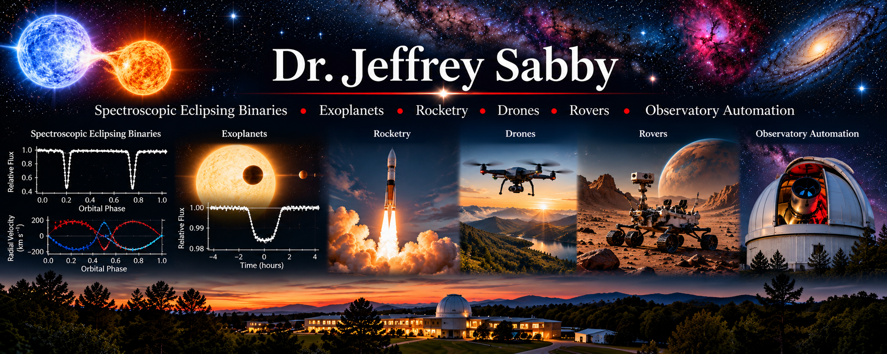

  

::: {.column-margin}

### Research Discoveries & Publications

*Scientific discovery feeds and selected research papers will appear here.*

:::

## Research Overview

My research interests encompass observational astrophysics, experimental physics, scientific instrumentation, and the development of autonomous systems for scientific investigation. These activities share a common objective: developing quantitative descriptions of physical systems and testing those descriptions through careful observation, experimentation, and computational analysis.

Throughout my research career, I have been particularly interested in problems that require the integration of theoretical physics, precision measurements, numerical modeling, and the design or adaptation of scientific instrumentation.

My work extends from the determination of fundamental stellar properties to the development of automated observatories, embedded control systems, and autonomous experimental platforms.

The following research areas reflect these interconnected scientific and engineering interests.

---

## Research Areas

### Spectroscopic Eclipsing Binaries

Eclipsing binary star systems provide some of the most powerful observational laboratories for determining fundamental stellar properties. When photometric light curves are combined with spectroscopic radial-velocity measurements, it becomes possible to determine stellar masses, radii, orbital parameters, and other physical characteristics with considerable precision.

My research has emphasized the spectroscopic investigation of eclipsing binary systems, particularly the measurement of stellar radial and rotational velocities. These measurements provide essential constraints on orbital solutions, stellar rotation, and the physical properties of binary components.

An important aspect of this work involves combining observations obtained at different orbital phases with theoretical models of binary-star dynamics. The interpretation of these observations requires careful attention to instrumental calibration, spectral-line analysis, observational uncertainty, and the physical assumptions underlying orbital and stellar models.

My continuing interests include the reanalysis of historical observations, eclipse-timing variations, stellar activity, orbital evolution, and the application of modern computational techniques to previously investigated systems.

### Exoplanets

The discovery and characterization of planets orbiting other stars represents a natural extension of stellar spectroscopy, orbital mechanics, and astronomical photometry.

My interests in exoplanet research include transit photometry, radial-velocity detection, orbital modeling, and the analysis of astronomical time-series observations. These methods provide complementary information about planetary systems, including orbital periods, planetary dimensions, orbital eccentricities, and constraints on planetary masses.

Transit observations require careful analysis of stellar brightness variations, including the distinction between planetary transits and signals produced by stellar activity, eclipsing binary systems, or instrumental effects.

Similarly, radial-velocity investigations depend on precise spectroscopic measurements and the ability to distinguish planetary orbital motion from other sources of stellar velocity variability.

Space-based missions such as Kepler and the Transiting Exoplanet Survey Satellite (TESS) have created extensive observational archives that provide opportunities for independent analysis, model validation, and the investigation of previously identified planetary candidates.

### Rocketry

My interests in experimental rocketry involve the application of classical mechanics, fluid dynamics, propulsion physics, electronics, and feedback-control theory to the design and investigation of rocket systems.

Rocket flight provides a particularly useful experimental environment for examining the relationship between theoretical predictions and measured system behavior. Important considerations include propulsion performance, aerodynamic forces, vehicle stability, flight trajectories, and the response of onboard instrumentation to rapidly changing environmental conditions.

I am particularly interested in the integration of embedded electronics, sensors, telemetry, and data-acquisition systems into experimental platforms.

These technologies make it possible to record flight parameters, reconstruct trajectories, compare observations with numerical simulations, and evaluate the performance of mechanical and electronic subsystems.

The broader scientific objective is to develop instrumented experimental systems in which physical models can be evaluated against reproducible measurements.

### Drones and Unmanned Aerial Systems

Unmanned aerial vehicles provide versatile experimental platforms for investigating flight dynamics, autonomous navigation, sensor integration, and real-time feedback control.

My interests include the relationship between vehicle dynamics and the algorithms used to maintain stable flight, execute controlled maneuvers, and respond to changes in environmental conditions.

These systems involve several interconnected areas of physics and engineering, including rigid-body dynamics, aerodynamics, inertial measurement, electronic instrumentation, and computational control.

Particular attention is given to the integration of microcontrollers, onboard computers, inertial sensors, positioning systems, and communication interfaces.

Beyond flight control, drones provide opportunities for developing mobile scientific instrumentation capable of collecting environmental, positional, and other experimental measurements.

The combination of autonomous operation and scientific data acquisition makes unmanned aerial systems valuable platforms for both engineering investigations and applied research.

### Robotic Rovers

Robotic rovers offer opportunities to investigate autonomous ground navigation, electromechanical design, sensor integration, and the interaction between computational control systems and physical environments.

My interests include the design of mobile robotic platforms capable of acquiring environmental information, processing sensor measurements, and responding to changing operating conditions.

These investigations involve mechanical systems, electric motors, feedback control, embedded computing, and the development of algorithms for navigation and obstacle detection.

Rover platforms are particularly useful for examining the relationship between theoretical control models and the performance of real electromechanical systems.

They also provide practical environments for experimenting with distributed sensors, telemetry, remote operation, and autonomous decision-making.

An important long-term objective is the development of robotic platforms that can function as mobile scientific instruments, extending observational and experimental capabilities beyond fixed laboratory environments.

### Observatory Automation

The development of automated astronomical observatories has been an important component of my scientific and engineering work.

I have designed and constructed three automated observatories, integrating astronomical instrumentation with mechanical systems, electronics, computer control, and scientific data-acquisition software.

An automated observatory requires the coordinated operation of numerous subsystems, including telescope mounts, imaging detectors, spectroscopic instruments, focus mechanisms, environmental sensors, and observatory enclosures.

These systems must operate reliably while maintaining the measurement precision required for scientific observations.

My interests include robotic telescope operation, instrumentation control, automated observing sequences, environmental monitoring, and the development of software systems for acquiring and processing astronomical data.

Observatory automation also provides a natural connection between observational astrophysics and mechatronics. Mechanical design, embedded electronics, sensor systems, feedback control, and scientific computing must function together as an integrated experimental facility.

The ultimate objective is to increase the reliability, efficiency, and scientific productivity of astronomical observations while maintaining the calibration, traceability, and reproducibility required for quantitative research.

---

## Research Philosophy

My approach to scientific investigation is grounded in the relationship between theoretical predictions and observational or experimental evidence.

A physical model must ultimately be evaluated through measurements that can test its assumptions and predictions. This requires careful experimental design, appropriate instrumentation, systematic data reduction, uncertainty analysis, and independent validation.

Computational methods play an increasingly important role in this process. Numerical simulations, statistical inference, optimization algorithms, and scientific visualization provide powerful tools for investigating complex physical systems.

However, computational results must remain consistent with established physical principles and be evaluated against analytical benchmarks, limiting cases, and observational evidence whenever possible.

I place particular emphasis on reproducibility, dimensional consistency, physical plausibility, and the explicit identification of uncertainties and model limitations.

Across astrophysics, experimental physics, and engineering, my objective is to develop scientifically meaningful conclusions supported by quantitative evidence.